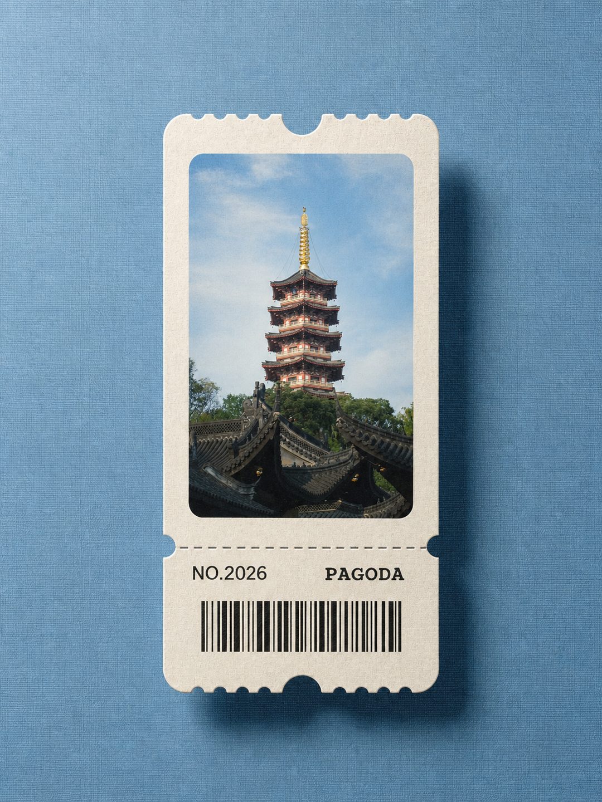

# Travel Ticket 旅行票根 Skill

把普通旅行照片转换成具有收藏感的复古票根海报：地点文字、编号、装饰条形码、织物背景、纸张纹理和真实投影。

> A reusable Codex image template that turns travel photos into vintage ticket-stub posters.



## 效果特点

- 3:4 竖版票根海报
- 居中的米白色纸质票券
- 圆角照片窗、齿孔和撕票虚线
- 可自定义地点英文与编号
- 半自适应背景：从每张原图独立提取协调色，再降低饱和度作为织物背景
- 保留原照片的主体、构图和可识别细节

## 安装方法

### 方法一：让 Codex 安装

把本仓库地址发给 Codex：

```text
请安装这个 Skill：
https://github.com/zczc1001/artifact-template-travel-ticket
```

### 方法二：手动安装

1. 在 Releases 下载 `artifact-template-travel-ticket.zip`。
2. 解压后，将 `artifact-template-travel-ticket` 文件夹放入 Codex 的个人 skills 目录。
3. 新建一个 Codex 任务，使用 `$artifact-template-travel-ticket` 调用。

## 使用示例

上传一张旅行照片，然后输入：

```text
使用 $artifact-template-travel-ticket 把这张照片制作成旅行票根海报。

地点英文：SUZHOU
编号：NO.2027
背景：从照片主色中自动提取低饱和颜色
主体必须保留：桥、船和远处塔楼
输出：1080×1440 PNG
```

地点英文建议控制在 12 个字符以内。条形码是装饰元素，不保证能够真实扫描。

背景颜色不是固定蓝色。Skill 会优先从照片中的天空、水面、植物、建筑材质或灯光提取一个辅助色，柔化后用于背景；只有原图适合蓝色时才使用蓝色。照片缺少明确色彩线索时，才回退到暖灰或石色等中性色。

## 文件结构

```text
artifact-template-travel-ticket/
├── SKILL.md
├── artifact-template.json
├── agents/
│   └── openai.yaml
└── assets/
    ├── preview.png
    └── reference.png
```

## 许可证

MIT License。你可以使用、修改和分享本 Skill，但请保留许可证文本。
